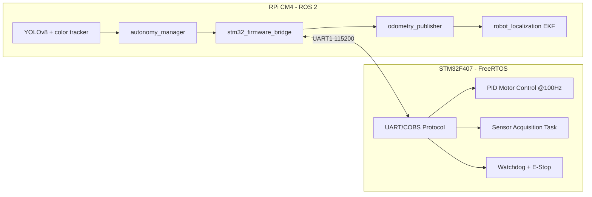

# Forest Surveillance Rover


Autonomous ground rover platform for forest monitoring with a split-compute architecture:

- Raspberry Pi CM4 runs ROS 2 autonomy, perception, and mission logic.
- STM32F407 runs hard real-time motor, sensor, and safety control.

Core field goals:

- detect animals with YOLOv8,
- detect smoke risk via MQ-2 gas sensing,
- track a red marker/ball for guided behaviors,
- patrol waypoints and report environmental telemetry.

## What We Are Building

The rover is designed as a practical surveillance robot for wooded environments where GNSS quality, visibility, and terrain can change quickly. The architecture separates deterministic control from high-level AI workloads:

- Phase 1 focus: embedded reliability and ROS-hardware bridge.
- Phase 2 focus: odometry, TF, EKF fusion, and autonomy bringup.
- Phase 3 focus: YOLOv8 detection, red ball tracking, smoke alert integration.
- Phase 4 focus: complete launch orchestration, telemetry logging, post-mission analysis.

## Implementation Retrospective (Completed To Date)

This repository now contains a completed infrastructure baseline plus executed Phase 1, 2, 3, and 4 software foundations.

### Phase 0 (Infrastructure Foundation)

- repository split preserved hardware history on `hardware/rev-a` and opened `main` for ROS-first software development,
- ROS 2 workspace with package layout for hardware, autonomy, perception, messages, and description,
- STM32 firmware project scaffold with FreeRTOS task model,
- Docker ARM64 environment for Raspberry Pi compatible development,
- GitHub Actions pipeline for build/lint/security workflows,
- architecture documentation and full implementation plan.

### Phase 1 (Hardware Driver Layer & Real-Time Firmware)

Implemented firmware and ROS bridge foundations:

- STM32 modular firmware components:
    - UART bridge with COBS framing and CRC16,
    - encoder abstraction and ISR-update path,
    - motor driver with watchdog stop handling,
    - non-blocking sensor polling interface for environmental data.
- ROS 2 interfaces (`forest_rover_msgs`):
    - `MotorCommand.msg`,
    - `MotorFeedback.msg`,
    - `EnvironmentalData.msg`,
    - `EmergencyStop.srv`.
- STM32 ROS bridge node (`stm32_firmware_driver`):
    - subscribes command velocity,
    - publishes IMU/environment/motor feedback/odometry raw streams,
    - exposes emergency stop service,
    - supports serial mode and simulation mode.

### Phase 2 (Autonomy & Navigation Base)

Implemented autonomy stack baseline:

- `autonomy_manager` package with:
    - wheel odometry publisher from motor feedback,
    - `odom -> base_link` TF broadcaster,
    - command-velocity smoother for acceleration-limited control,
    - lightweight patrol waypoint publisher.
- EKF configuration for `robot_localization` sensor fusion.
- Rover URDF/xacro model with base, wheels, camera, and IMU frames.
- Phase-2 bringup launch that composes description + bridge + autonomy nodes.

### Phase 3 (Vision & Detection)

Implemented perception and safety-detection stack:

- `yolo_detector_node`:
    - YOLOv8 inference pipeline with confidence/NMS configuration,
    - simulation fallback mode when model/runtime is unavailable,
    - publishes `/perception/detections` and inference FPS telemetry.
- `color_tracker_node`:
    - HSV-based red object extraction,
    - contour centroid and distance estimation,
    - publishes `/perception/ball_centroid`, tracking confidence, and debug image.
- `smoke_detection_node`:
    - threshold-based smoke classification,
    - publishes `/gas_sensor/reading` and `/alerts/smoke_detected`,
    - emits structured rover events for autonomy/logging.
- `autonomy_manager` integration:
    - smoke alerts switch state from patrol to investigate-fire route.

### Phase 4 (Integration & Hardening Foundation)

Implemented system-integration and observability baseline:

- complete launch pipeline via `complete.launch.xml`.
- `data_logger_node` with SQLite mission persistence for telemetry, detections, odometry, and events.
- post-mission CLI analysis script for detection and odometry summaries.
- integrated launch layers:
    - phase-2 mobility/autonomy,
    - phase-3 perception,
    - phase-4 logging.

### Phase 5 (LoRa Telemetry & Remote Operations)

Implemented long-range telemetry and ground station monitoring:

- `telemetry_gateway_node`: rover-side 10-second heartbeat transmission aggregating odometry, detections, battery, smoke alerts, gas sensor, and autonomy state.
- `base_station_receiver_node`: ground station node with SQLite logging, alert monitoring, and rover location publishing.
- `RFM95W LoRa firmware driver` (C): 868 MHz SPI-based radio control with CRC-16 CCITT validation, buffer overflow protection, and Friis path loss distance estimation.
- ROS 2 message types: `TelemetryHeartbeat` (15 fields), `LoRaStatus` (11 fields).
- Phase 5 launch composition integrating phases 2-5 with complete orchestration.
- Production hardening: thread-safe state locks, database context managers, input validation, smoke alert state reset, CRC receive validation framework.
- All 15 workspace packages compile with zero errors; code review verified all critical and high-severity issues resolved.

## System Architecture



## Repository Layout

```text
ros2_workspace/
    src/
        forest_rover_msgs/            # custom ROS interfaces (includes Phase 5: TelemetryHeartbeat, LoRaStatus)
        forest_rover_description/     # URDF + bringup launch orchestration (includes phase5_telemetry.launch.py)
        forest_rover_hardware/        # robot_state_publisher for URDF
        forest_rover_core/            # core node libraries
        forest_rover_autonomy/        # metapackage helper
        forest_rover_perception/      # metapackage helper
        forest_rover_utils/           # shared utilities
        stm32_firmware_driver/        # STM32 bridge node (includes RFM95W LoRa driver)
        autonomy_manager/             # phase-2 odom and control nodes
        yolo_detector_node/           # phase-3 animal detector
        color_tracker_node/           # phase-3 red ball tracker
        smoke_detection_node/         # phase-3 smoke alert logic
        data_logger_node/             # phase-4 mission logger + analysis
        telemetry_gateway_node/       # phase-5 rover heartbeat transmission
        base_station_receiver_node/   # phase-5 ground station logging

firmware/
    STM32_FirmwareProject/
        Core/Inc/                       # firmware headers
        Core/Src/                       # firmware implementation
    stm32/Drivers/RFM95W/
        rfm95w_lora_driver.h            # phase-5 LoRa radio driver header
        rfm95w_lora_driver.c            # phase-5 LoRa radio driver implementation

docker/                           # arm64 dev environment
docs/                             # architecture and planning docs
```

## Quick Start

### 1) Build ROS 2 workspace

```bash
cd ros2_workspace
colcon build --symlink-install
source install/setup.bash
```

### 2) Run complete integration bringup (Phase 2-5: autonomy + perception + logging + telemetry)

```bash
ros2 launch forest_rover_description phase5_telemetry.launch.py
```

### 3) Or run Phase 2-4 bringup (autonomy + perception + logging, without telemetry)

```bash
ros2 launch forest_rover_description complete.launch.py
```

### 4) Verify key topics

```bash
ros2 topic echo /environmental/data
ros2 topic echo /raw_motor_feedback
ros2 topic echo /odometry/raw
ros2 topic echo /perception/detections
ros2 topic echo /alerts/smoke_detected
ros2 service call /emergency_stop forest_rover_msgs/srv/EmergencyStop "{stop: true, reason: 'test'}"
```

### 4) Analyze mission logs (Phase 4)

```bash
python3 install/data_logger_node/lib/data_logger_node/analyze_mission.py mission_logs/mission_events.db
```

## Firmware Build (Toolchain Required)

```bash
cd firmware/STM32_FirmwareProject
mkdir -p build && cd build
cmake -DCMAKE_BUILD_TYPE=Release ..
make
```

Expected outputs:

- `forest-rover-firmware.elf`
- `forest-rover-firmware.hex`
- `forest-rover-firmware.bin`

## Engineering Notes

- UART protocol uses packet framing to protect against byte-stream corruption.
- Watchdog behavior is integrated in both firmware and ROS-side service path.
- Autonomy layer currently prioritizes deterministic control flow and debug visibility over full mission complexity.
- Hardware and software are intentionally decoupled to keep real-time stability independent from AI/perception load.

## Roadmap Snapshot

- Completed: Phase 0, Phase 1, Phase 2, Phase 3, Phase 4, and Phase 5 implementation baselines.
- Phase 5 includes: LoRa telemetry gateway, base station receiver, RFM95W firmware driver, and complete ground station monitoring.
- Next: field-calibration, long-duration mission validation, and performance tuning on target hardware (with Phase 2 STM32 SPI integration for RFM95W).

## License

MIT License. See `LICENSE`.
