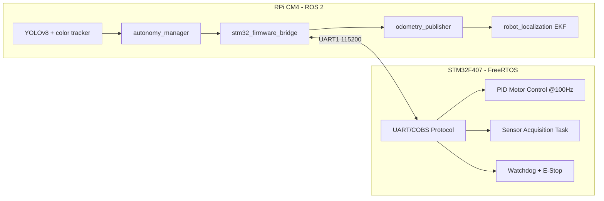

# Forest Surveillance Rover


Autonomous ground rover platform for forest monitoring with a split-compute architecture:

- Raspberry Pi CM4 runs ROS 2 autonomy, perception, and mission logic.
- STM32F407 runs hard real-time motor, sensor, and safety control.

Core field goals:

- detect animals with YOLOv8,
- detect smoke risk via MQ-2 gas sensing,
- track a red marker/ball for guided behaviors,
- patrol waypoints and report environmental telemetry.

## What We Are Building

The rover is designed as a practical surveillance robot for wooded environments where GNSS quality, visibility, and terrain can change quickly. The architecture separates deterministic control from high-level AI workloads:

- Phase 1 focus: embedded reliability and ROS-hardware bridge.
- Phase 2 focus: odometry, TF, EKF fusion, and autonomy bringup.
- Later phases: full perception stack and mission-level behavior.

## Implementation Retrospective (Completed To Date)

This repository now contains a completed infrastructure baseline plus executed Phase 1 and Phase 2 software foundations.

### Phase 0 (Infrastructure Foundation)

- repository split preserved hardware history on `hardware/rev-a` and opened `main` for ROS-first software development,
- ROS 2 workspace with package layout for hardware, autonomy, perception, messages, and description,
- STM32 firmware project scaffold with FreeRTOS task model,
- Docker ARM64 environment for Raspberry Pi compatible development,
- GitHub Actions pipeline for build/lint/security workflows,
- architecture documentation and full implementation plan.

### Phase 1 (Hardware Driver Layer & Real-Time Firmware)

Implemented firmware and ROS bridge foundations:

- STM32 modular firmware components:
    - UART bridge with COBS framing and CRC16,
    - encoder abstraction and ISR-update path,
    - motor driver with watchdog stop handling,
    - non-blocking sensor polling interface for environmental data.
- ROS 2 interfaces (`forest_rover_msgs`):
    - `MotorCommand.msg`,
    - `MotorFeedback.msg`,
    - `EnvironmentalData.msg`,
    - `EmergencyStop.srv`.
- STM32 ROS bridge node (`stm32_firmware_driver`):
    - subscribes command velocity,
    - publishes IMU/environment/motor feedback/odometry raw streams,
    - exposes emergency stop service,
    - supports serial mode and simulation mode.

### Phase 2 (Autonomy & Navigation Base)

Implemented autonomy stack baseline:

- `autonomy_manager` package with:
    - wheel odometry publisher from motor feedback,
    - `odom -> base_link` TF broadcaster,
    - command-velocity smoother for acceleration-limited control,
    - lightweight patrol waypoint publisher.
- EKF configuration for `robot_localization` sensor fusion.
- Rover URDF/xacro model with base, wheels, camera, and IMU frames.
- Phase-2 bringup launch that composes description + bridge + autonomy nodes.

## System Architecture



## Repository Layout

```text
ros2_workspace/
    src/
        forest_rover_msgs/            # custom ROS interfaces
        forest_rover_description/     # URDF + bringup launch
        forest_rover_hardware/
            stm32_firmware_driver/      # STM32 bridge node
        autonomy_manager/             # phase-2 odom and control nodes

firmware/STM32_FirmwareProject/
    Core/Inc/                       # firmware headers
    Core/Src/                       # firmware implementation

docker/                           # arm64 dev environment
docs/                             # architecture and planning docs
```

## Quick Start

### 1) Build ROS 2 workspace

```bash
cd ros2_workspace
colcon build --symlink-install
source install/setup.bash
```

### 2) Run Phase 2 bringup (simulation bridge mode)

```bash
ros2 launch forest_rover_description phase2_bringup.launch.py
```

### 3) Verify key topics

```bash
ros2 topic echo /environmental/data
ros2 topic echo /raw_motor_feedback
ros2 topic echo /odometry/raw
ros2 service call /emergency_stop forest_rover_msgs/srv/EmergencyStop "{stop: true, reason: 'test'}"
```

## Firmware Build (Toolchain Required)

```bash
cd firmware/STM32_FirmwareProject
mkdir -p build && cd build
cmake -DCMAKE_BUILD_TYPE=Release ..
make
```

Expected outputs:

- `forest-rover-firmware.elf`
- `forest-rover-firmware.hex`
- `forest-rover-firmware.bin`

## Engineering Notes

- UART protocol uses packet framing to protect against byte-stream corruption.
- Watchdog behavior is integrated in both firmware and ROS-side service path.
- Autonomy layer currently prioritizes deterministic control flow and debug visibility over full mission complexity.
- Hardware and software are intentionally decoupled to keep real-time stability independent from AI/perception load.

## Roadmap Snapshot

- Completed: Phase 0, Phase 1, Phase 2 foundations.
- Next: perception completion (YOLOv8 runtime optimization, red-ball tracker tuning, event-driven mission manager).
- After that: field validation, telemetry hardening, and long-duration endurance tests.

## License

MIT License. See `LICENSE`.
