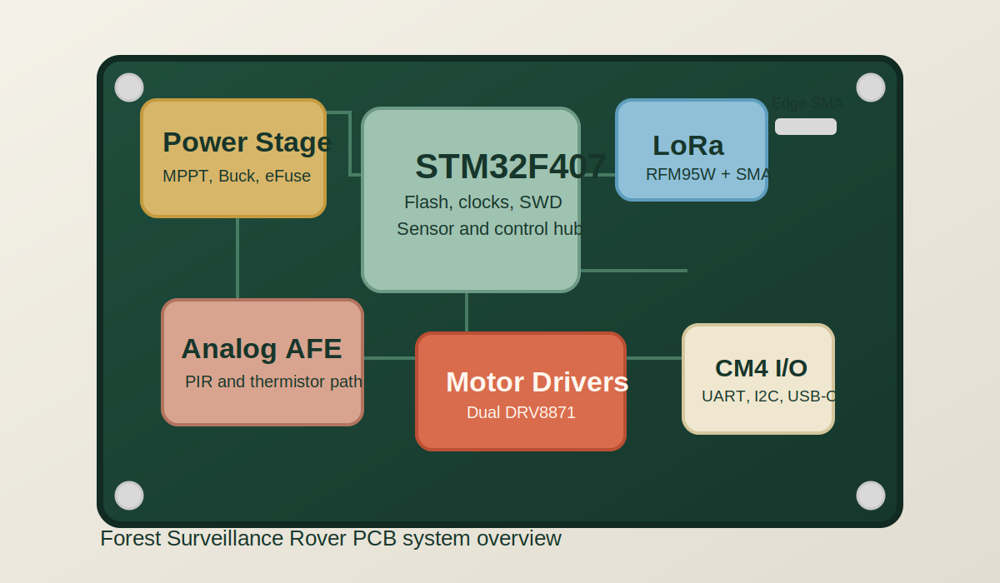
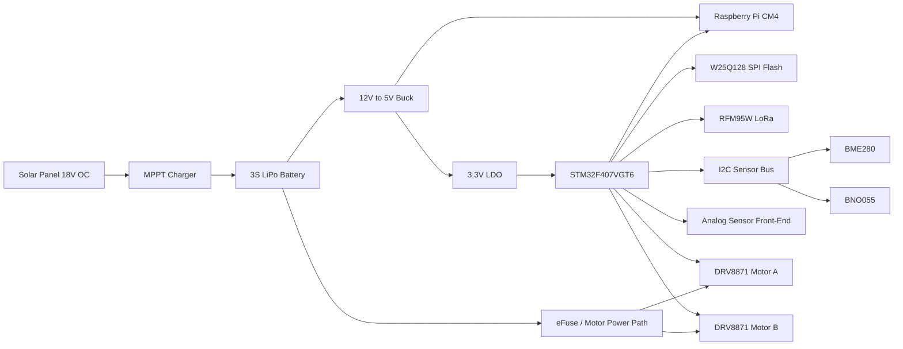

# Forest Surveillance Rover PCB

A 4-layer KiCad main-controller board for an autonomous forest surveillance rover, integrating power management, motor control, LoRa telemetry, and multi-sensor fusion on a single board.



Designed as the rover's central electronics hub, this board ties together the battery and solar power path, real-time control around an STM32F407, long-range telemetry over LoRa, and expansion interfaces for onboard and off-board sensing.

## Features

- 4-layer PCB stackup: Signal / GND / Power / Signal
- Approximate board outline: 100 mm x 80 mm with four M3 mounting holes
- Dual-input power architecture for 3S LiPo battery and solar charging
- LT3652-inspired MPPT charging stage with reverse-polarity protection
- TPS54331 12V-to-5V main buck rail and AMS1117-3.3 secondary rail
- STM32F407VGT6 main MCU with SWD, crystals, external SPI flash, and expansion header
- Dual DRV8871 DC motor channels with current sensing and encoder interfaces
- Integrated environmental sensing with BME280 and BNO055 on the shared I2C bus
- LoRa telemetry using an RFM95W footprint and edge-mount SMA connector
- Raspberry Pi CM4 companion interface over UART, I2C, interrupt, and USB-C power/data

## Block Diagram



## Design Tools

- KiCad 7+
- Ngspice
- Qucs-S

## How To Open

1. Clone the repository.
2. Open `hardware/kicad/forest-rover.kicad_pro` in KiCad 7 or newer.
3. Review the supporting notes in `docs/` before editing the schematic or layout.

## Simulation

Run the simplified power-stage simulations from the repository root or inside `simulation/ngspice/`:

```bash
ngspice simulation/ngspice/buck-converter.spice
ngspice simulation/ngspice/battery-charger.spice
```

Qucs-S notes for the analog front-end are in `simulation/qucs-s/README.md`.

## Design Decisions

The board uses a 4-layer stackup to keep return paths tight, simplify power distribution, and improve EMI behavior around the buck converter, motor drivers, and LoRa section. A dedicated MPPT-style charging path makes the solar input story believable for an outdoor rover, while the STM32F407 plus CM4 split keeps real-time control separate from higher-level autonomy and networking tasks.

Component selection favors common parts with strong documentation and broad availability. Built-in KiCad libraries are preferred wherever practical, and the design notes call out where footprints or symbols may need refinement before fabrication.

## Hardware Summary

| Area | Implementation |
| --- | --- |
| Main controller | STM32F407VGT6 with HSE/LSE clocks, SWD, BOOT0 access, and external W25Q128 SPI flash |
| Main power tree | 3S LiPo input, LT3652-style solar charging path, TPS54331 5V rail, AMS1117-3.3 logic rail |
| Motor path | Battery-fed motor rail behind TPS2596 eFuse with two DRV8871 motor channels |
| Sensors | BME280, BNO055, PIR analog front-end, thermistor divider, external LIDAR and thermal camera headers |
| Communications | RFM95W LoRa module with edge SMA, CM4 UART/I2C/interrupt interface, USB-C support |

## Status

Prototype Rev A - fabricated and tested

## Repository Layout

- `docs/` contains design notes, the BOM, block diagram, and power budget
- `hardware/kicad/` contains the KiCad project and design files
- `simulation/` contains the simplified Ngspice and Qucs-S examples
- `firmware/` points to the future software repository split
- `images/` holds rendered-board assets and future exports

## License

Released under the MIT License. See `LICENSE`.
