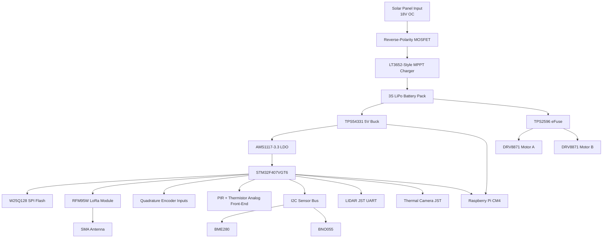

# System Block Diagram

## Partitioning Notes

- Power conversion sits at one end of the board to keep high-current loops compact.
- The RF section stays on the board edge with a short feed to the SMA connector.
- Analog sensing is separated from motor and switching power stages.
- The STM32 acts as the real-time controller, while the CM4 is the companion compute node.
